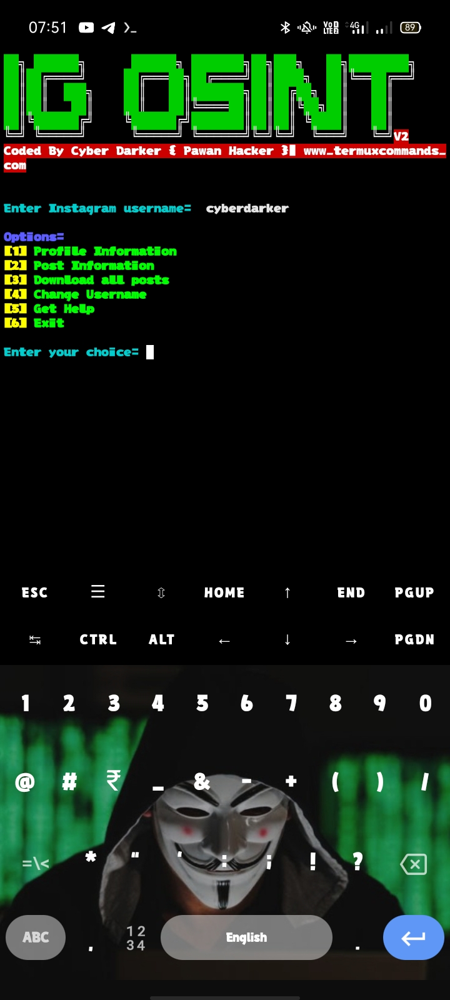

# IG-OSINT-V2
A simple Instgram Osint tool to gather instgram user informations.

## Screenshorts After installing IG-OSINT-V2
### TOOLS 


## INSTALLATION COMMANDS
```
apt update && apt upgrade -y
```
```
pkg install git python -y
```
```
termux-setup-storage
```
```
git clone https://github.com/cyberdarker/IG-OSINT-V2
```
```
cd IG-OSINT-V2
```
```
pip install instaloader
```
```
python ig.py
```
